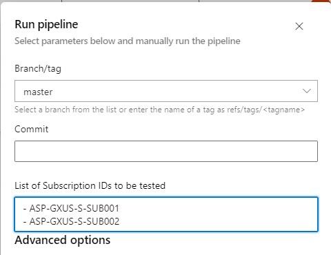
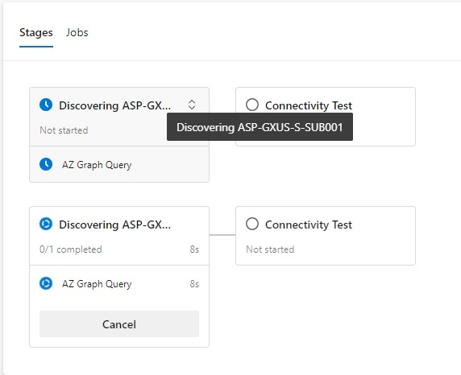
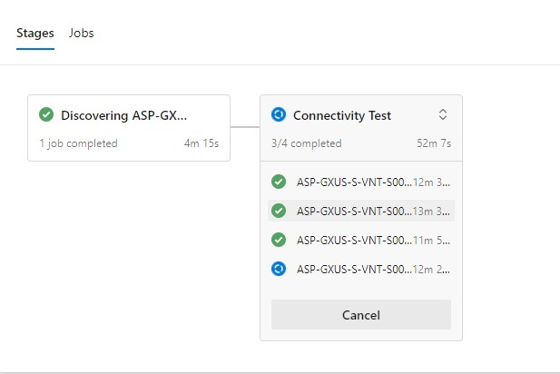

<p align="right">
 
</p>

#
# Virtual Network Test Pipeline
T# Virtual Network Test Pipeline

This PoC demonstrates the implementation of [strategy:matrix](https://learn.microsoft.com/en-us/azure/devops/pipelines/yaml-schema/jobs-job-strategy?view=azure-pipelines#strategy-matrix-maxparallel) to generate a dynamic number of jobs based on a discovery process that runs a [Resource Graph query](https://learn.microsoft.com/en-us/azure/governance/resource-graph) in Azure.

This pipeline receives a list of subscription names as arguments and launches as many parallel stages as subscriptions, each containing the testing scripts. It uses a template `stages/vnt-testing.yml` and an `each` loop to trigger multiple stages, one per subscription passed as an argument:

```yaml
stages:
  - ${{ each thisSub in parameters.SubsIds }}:
    - template: stages/vnt-testing.yml
      parameters:
        thisSubsName: ${{ thisSub }}
        thisSubsSuffix: ${{ split(thisSub, '-')[3] }}
```

<br>
<p align="center">
    
<p align="center">
     
</p>
<p align="center">
    
</p>

<br></br>
# 
## Discovering Stage

It runs a powershell script that executes a Resource Graph query.
The ouput of the script is json array, the final output is a dictionary containg all the VNTs information needed for the next stage to run the Azure Powershell Scripts:

```json
{
  "virtualnetworks": {
    "ASP-EUS-S-VNT-S001D": {
      "resourceId": "/subscriptions/12345678-abcd-efgh-1234-123456789abc/resourceGroups/ASP-EUS-S-RGBA-S001D/providers/Microsoft.Network/virtualNetworks/ASP-EUS-S-VNT-S001D",
      "adressSpace": "10.0.3.0/24",
      "resourceGroup": "/subscriptions/12345678-abcd-efgh-1234-123456789abc/resourceGroups/ASP-EUS-S-RGBA-S001D"
    },
    "ASP-EUS-S-VNT-S001B": {
      "resourceId": "/subscriptions/12345678-abcd-efgh-1234-123456789abc/resourceGroups/ASP-EUS-S-RGBA-S001B/providers/Microsoft.Network/virtualNetworks/ASP-EUS-S-VNT-S001B",
      "adressSpace": "10.0.1.0/24",
      "resourceGroup": "/subscriptions/12345678-abcd-efgh-1234-123456789abc/resourceGroups/ASP-EUS-S-RGBA-S001B"
    },
    "ASP-EUS-S-VNT-S001A": {
      "resourceId": "/subscriptions/12345678-abcd-efgh-1234-123456789abc/resourceGroups/ASP-EUS-S-RGBA-S001A/providers/Microsoft.Network/virtualNetworks/ASP-EUS-S-VNT-S001A",
      "adressSpace": "10.0.0.0/24",
      "resourceGroup": "/subscriptions/12345678-abcd-efgh-1234-123456789abc/resourceGroups/ASP-EUS-S-RGBA-S001A"
    },
    "ASP-EUS-S-VNT-S001C": {
      "resourceId": "/subscriptions/12345678-abcd-efgh-1234-123456789abc/resourceGroups/ASP-EUS-S-RGBA-S001C/providers/Microsoft.Network/virtualNetworks/ASP-EUS-S-VNT-S001C",
      "adressSpace": "10.0.2.0/24",
      "resourceGroup": "/subscriptions/12345678-abcd-efgh-1234-123456789abc/resourceGroups/ASP-EUS-S-RGBA-S001C"
    }
  }
}
```

This dictionary is set as a variable output for the nex stage:
```powershell
`Write-Host "##vso[task.setvariable variable=virtualNetworks;isoutput=true]$virtualNetworks"`
```

<br></br>
# 
## Connectivity Test Stage

This stage makes use of the [Strategy/Matrix ADO capability](https://learn.microsoft.com/en-us/azure/devops/pipelines/yaml-schema/jobs-job-strategy?view=azure-pipelines):

```yml
strategy:
maxParallel: 5
matrix: $[ stageDependencies.AzGraph_${{ parameters.thisSubsSuffix }}.query.outputs['discovered.virtualNetworks'] ]
```

The number of jobs whithin each `Connectivity Test` stage will depend on the number of VNTs keys.

VNT keys will be expanded when the matrix instruction is executed, all the keys nested under `virtualnetworks` will trigger a new job.
For the above example 4 jobs will be trigered in parallel: `ASP-EUS-S-VNT-S001A` to `ASP-EUS-S-VNT-S001D`.

This capability allows this pipeline stages to run a dinamic number of VNTs test


This picture helps to understand how the json variable `virtualnetworks` is analized:


